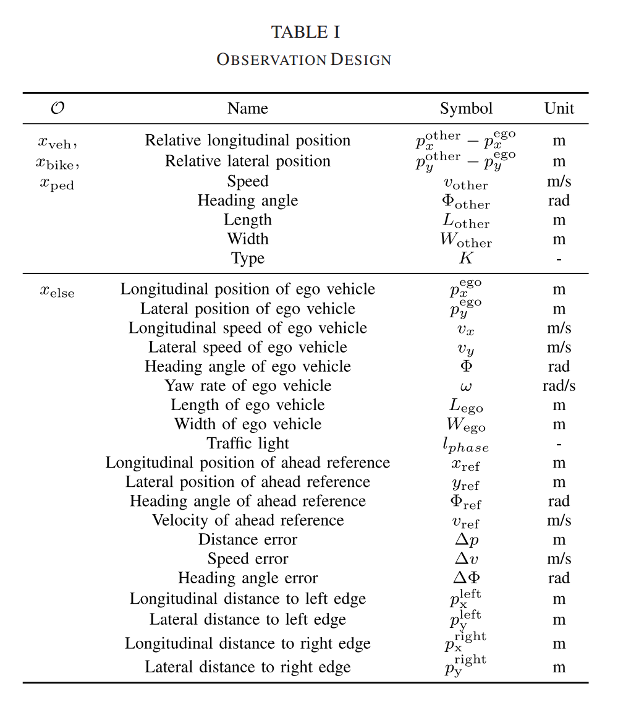
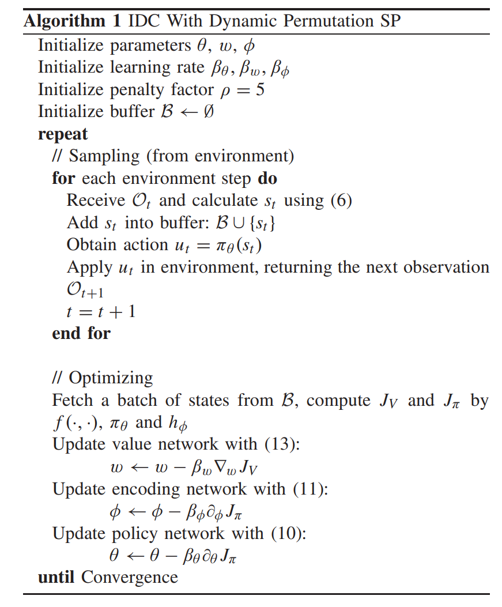
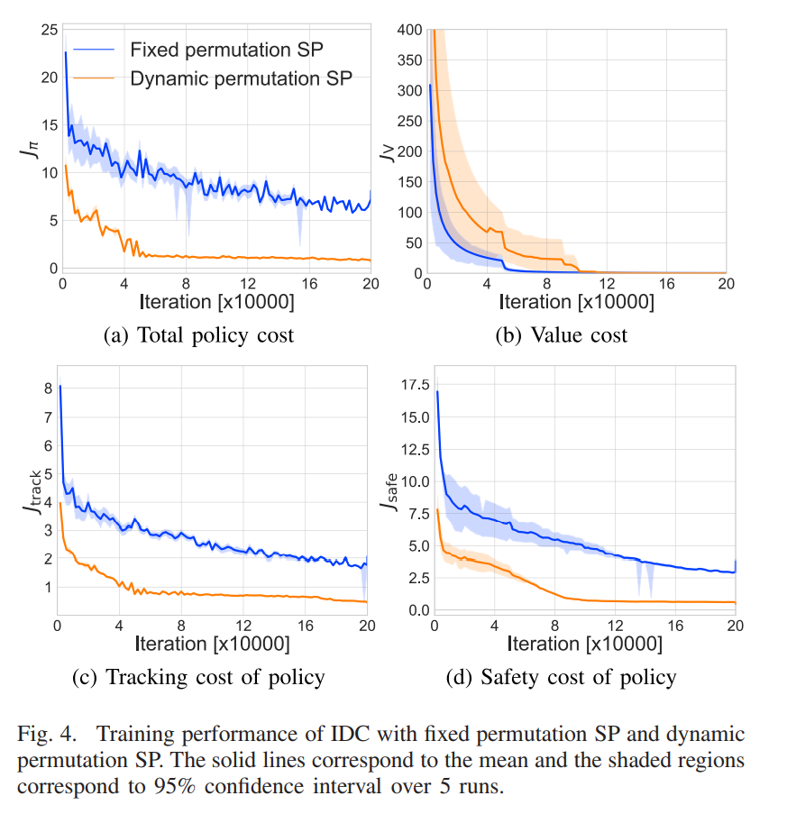
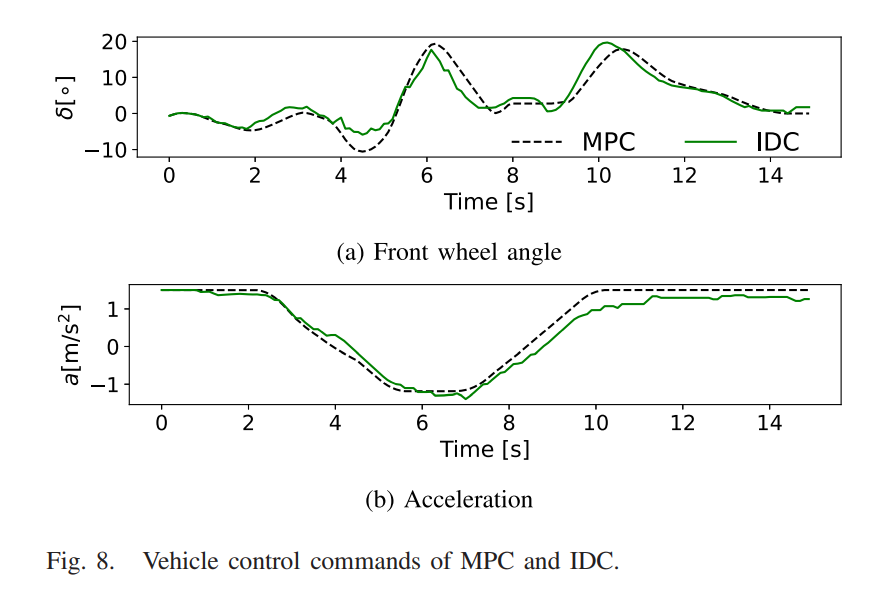

# [PaperReading RL 01]Self-Learned Intelligence for Integrated Decision and Control of Automated Vehicles at Signalized Intersections

原文链接：https://arxiv.org/abs/2110.12359

## Abstract
本文的研究场景为十字路口，交通参与者包含行人、车辆、自行车等。提出了一种动态排列的状态表征方法，该方法下生成的状态可以表示不同数量、不同类型的交通参与者。在结构化道路场景中，以最小化跟踪误差和约束违犯惩罚之和，构建最优化问题，利用梯度下降的方法进行求解，实现车辆的跟踪控制。实验表明，可以保证车辆通过十字路口的高效性、舒适性、安全性。
## Motivation
基于强化学习的算法，输入的状态矩阵是固定维数的，所以需对输入各状态量制定排列规则（比如用相对距离的远近进行排序）以及设定ego所处车道上周围车辆数量。但在混合交通流中，例如同时有行人、自行车等，这种方法并不适用。行人、摩托车等运动轨迹不受车道限制。所以，文章着重解决两个问题：能否解决混合交通流下的状态表征，尤其是对行人、自行车等物体的状态构建？能否解决动态数量的状态表征问题？
## Contributions
1. 用一个encoding network将交通参与者的信息输出成一个向量，作为state，再输入到actor network和value network当中。
2. 构建最优问题，对行车安全（交通参与者间的距离、和stop line之间的距离）添加约束惩罚，以最小化惩罚与跟踪代价之和为目标，利用梯度下降的方法进行求解。
3. 进行了实验，表明利用encoding network的状态表征方法可以显著降低代价指标。
## Method
1. 状态表征

    encoding network利用参数$\phi$表示。$x_{i}^{veh}$ 表示周围检测到的第$i$辆车的状态向量。$x_{i}^{bike}$和$x_{i}^{ped}$分别表示自行车和行人。用$L',M',N'$依次表示它们三者的最大检测数，实验中依次设置为10、6、6。将三者加起来，然后再和$x_{\text{else}}$ 进行cat，得到最终的状态$s$。将这个状态输入进actor network输出动作，value network输出状态价值。
    
    动作空间为前轮转向角$\delta \in [-0.4，0.4]$rad和加速度为$[-3,1.5]m/s^{2}$。
    
    状态空间的特征选取：
    

    
2. 优化问题构造
    
    对于策略网络的优化目标，考虑如下两项加权和，$J_{\text{track}}$和$J_{\text{safe}}$。其中安全项的系数为$\rho$，跟踪性能项的系数为1。Encoding Network的优化目标与上述一致。
    
    
    价值网络的优化目标为Utility function与该状态下的状态价值之差的平方。
    
    
    算法设计：
    
    
5. Utility Function 与 Constraint Function
    
    
    跟踪位置误差、速度差、航向角差、转向角差、角速度差、加速度差。
    
    约束考虑了避障约束以及停车线约束。避障约束用的圆盘法，停车线约束设定在停车线前0.5m。
    
## Simulation
仿真结果：

## Conclusion

主要解决了状态空间输入量以及输入类型是未知情况下，如何处理的问题。按照障碍物类型设计状态空间的特征，然后通过一个编码器编码特征，再输入到actor-critic架构中。最后的效果来看，效果还不错，神经网络的推理运行速度很快。