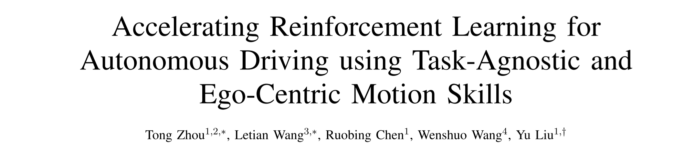
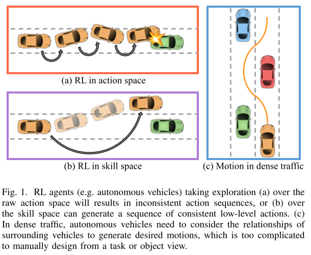
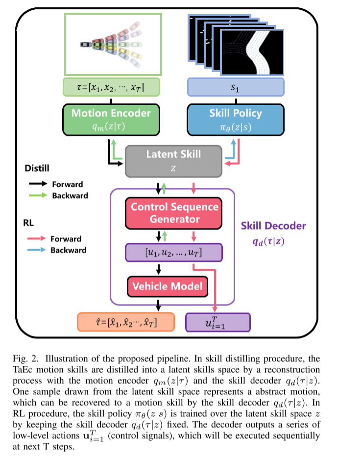
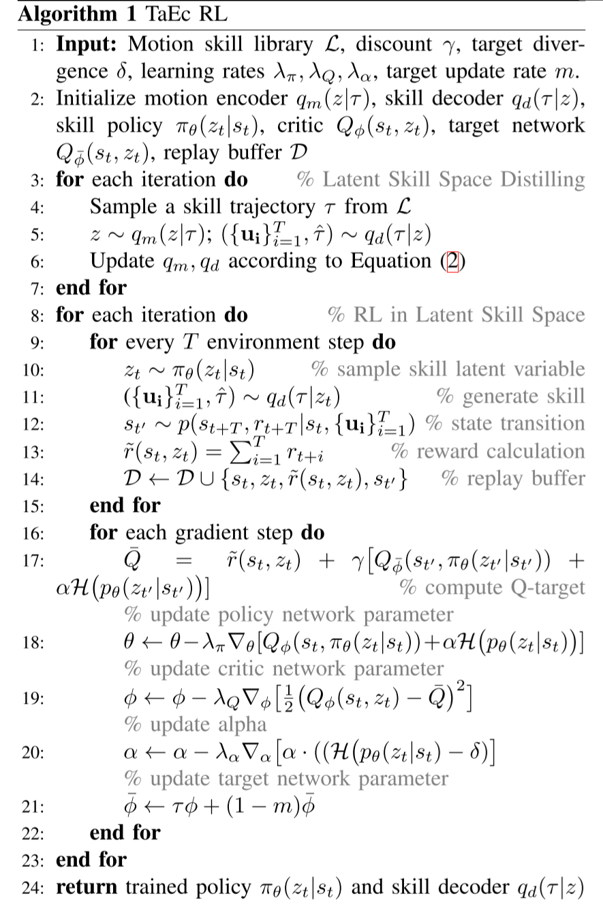
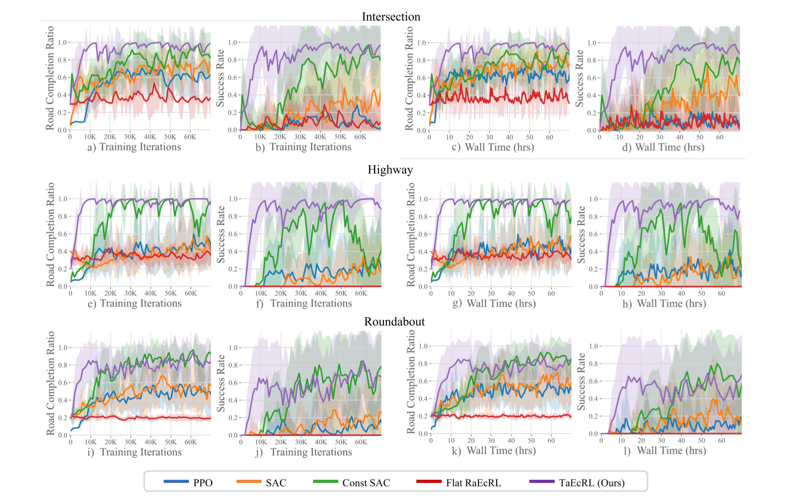
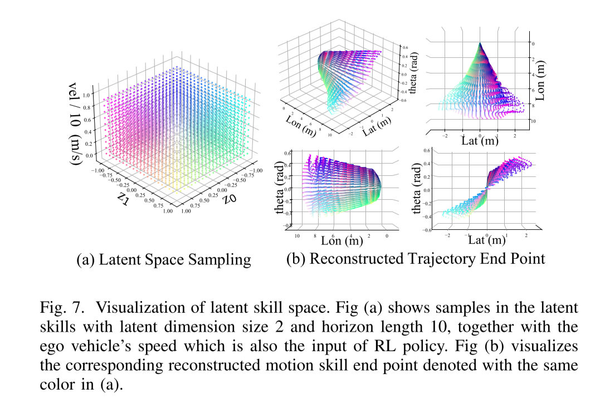
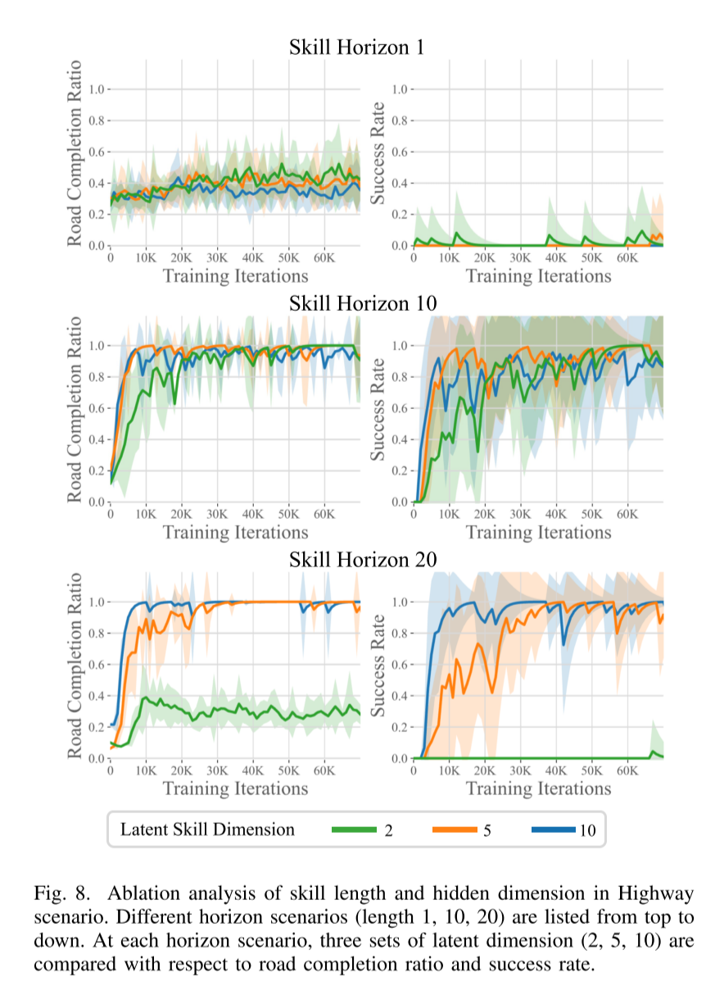

# [PaperReading RL 02]Accelerating Reinforcement Learning for Autonomous Driving using Task-Agnostic and Ego-Centric Motion Skills

**2022 上海人工只能实验室 (https://www.shlab.org.cn/) {Arixv: https://arxiv.org/pdf/2209.12072.pdf}**

## 0\. Summary

+ design a task-agnostic and ego-centric motion skill library: 
    + why? train the encoder and decoder
    + objective: generate a latent skill for agent to learn

+ combine with original method (Lattice, kinematic bicycle model)

+ evaluate the method with baselines (PPO, SAC) in dense-traffic

+ ablatation study (skill horizon & latent skill dimension)

## 1\. Research Objective(s)

### 1.1 Can we improve training efficiency? (unblanced ditribiton & highly cost to collect expert demonstrations)

### 1.2 Can we learn all essential skills (use a latent space) to handle compelx scenario?

## 2\. Background

### 2.1 RL in autonomous driving

+ learning efficiency will quickly decay due to un-informed exploration and the sparse and delayed rewards

### 2.2 Pre-training policy & IL (expert demonstrations)

+ **unavailable** are expensive and labor-intense to collect and annotate if unavailable

+ **suboptimal** unbalanced in distribution and hardly optimal-guaranteed

+ **generalization** struggling to transfer to new tasks as the demonstrations are environment-conditioned or task-specific

### 2.2 RL Limitations: 

+ rarely reflect driving intentions

For example: 

+ If offline training agent, it is hard to guarantee all essential skills

+ If task-specific, skill design limits the flexibility and expressiveness of motions. Hard to apply in dense traffic scenario.

## 3\. Method(s)

    TaEc-RL (RL with Task-agnostic and Ego-centric motion skills)

### 3.1 Overview

+ design a task-agnostic and ego-centric (TaEc) motion skill library

+ distill these motion skills into a lowdimensional latent skill space

+ solve diverse, complex tasks like driving in multi-agent settings

### 3.2 Ego-Centric Task-Agnostic Motion Skill Library

+ Path Generation (**Lattice**)

    + Each node contains three dimensions of longitude, latitude and heading angle

    + start node is the origin of ego-vehicle’s coordinate system
    
    + end nodes are uniformly sampled along longitude, latitude and heading angle dimensions

+ Speed Profile Generation

    + $v(t)=q_{0}+q_{1}*t+q_{2}*t^{2}+q_{3}*t^{3}$

    + sample time horizon and terminal speed

    + fixed initial speed

+ Raw Trajectory Generation

    + how to combine path with speed [Ref:7.1](#71-spatial-temporal-planning)

    + a series of vehicle states $[x_{1},x_{2},...,x_{T_{h}}]$, $x_{t}= [x_{t},y_{t}, \phi_{t}, v_{t}] \forall t\in [1,...,T_h]$

    + why do the raw trajectories need to be processed to get TaEc Motion Skill?

        + the horizon Th is so long that the trajectory may contain multiple skills
        + the unbalance of generated trajectory (straightline drivings occupy a substantial proportion)

+ TaEc Motion Skill Generation

    + **Slicing:**  The long-horizon trajectory with length Th is mapped into sliding windows with length T and sliding interval T/2.

    + **Filtering:** We then perform a filtering operation by building a lookup table. 

        + 5-dimensional keys: the terminal node and the arc length of the trajectory

        + each key in the table only keeps one trajectory

### 3.3 Latent Skill Space Distilling

+ a generative model consisting of a motion encoder $q_m(z|\tau)$ and a skill decoder $q_d(\tau|z)$

+ use **vehicle kinematic model** to convert the output of skill decoder into
reasonable and reachable trajectories

+ encoder: takes motion skill $\tau$ as input and outputs the parameters for Gaussian
distribution of the latent skill $z$ (Gaussian distribution).

+ The skill decoder outputs a sequence of control actions at every time, which are denoted as $[u_1, u_2, ...u_T]$, given
initial state $x_0$. contraol variables are acceleration and steering angle. When generates traj, consider constraints such as highest speed, highest acceleration and the range steering angle.

+ Loss: $E_{q_{m}}\left[ {\log q_{d}(\tau |z)- \beta(\log q_{m}(z| \tau)- \log p(z)}\right] $

+ Note: the first item is the error (position, velocity, heading angle) between $\hat{\tau}$ and the $\tau$ at each time stamp.

### 3.4 RL with Exploration in Skill Space

+ **GOAL:** learn a policy that outputs latent skill variables $\pi_{\theta}(z|s)$

+ Policy Loss: 

    $J=E_{\pi}[\sum_{i=1}^{N}\gamma^{i}\tilde{r}(s_{i},z_{i})+ \alpha \mathcal{H}(\pi_{\theta}(z|s))]$

    penalizing jerks, collisions, and driving out of road

+ alpha Loss (assume the latent space is uniform distribution): 

    $\mathcal{H}(\pi_{\theta}(z|s))=-E[ \log \pi_{\theta}(z|s)] \propto -D_{KL}(\pi_{\theta}(z|s),U(z))$
    
    Loss = $\alpha E[\mathcal{H}(\pi_{\theta}(z|s)) - \delta]$

    $\delta$ is the target divergence

### 3.5 Algorithm

## 4\. Evaluation (MetaDrive https://metadrive-simulator.readthedocs.io/en/latest/)

### 4.1 Experiment setting

+ observation:  a 5-channel bird-eye view image as observation tensor with a size of 200 × 200 × 5

+ reward: $r_{t}=c_{1}\cdot R_{driving}+c_{2}\cdot R_{speed}+c_{3}\cdot R_{termination}+c_4 \cdot R_{jerk}$
    + $R_{driving}=d_{t}-d_{t-1}$ longitudinal coordinates of the ego vehicle in the current lane of two consecutive time steps
    + $R_{speed}=v_{t}/v_{max}$
    + $R_{termination}$, large positive reward for reaching goal, negative if run out of the road or crash, zero if the game is not terminal
+ Note: Once a skill is chosen, T actions are executed before sampling the next skill, and the reward will be the summary of T-step rewards $\tilde{r}=\sum_{t=1}^{T} r_{t}$. Here we set T=10. 

+ baseline: PPO, SAC, Flat TaEcRL (T=1), SAC constant (output a fixed control signal)

---
> we test all experiments on a single **V100 GPU** with **16 CPUs** and **150G** of memory
---

### 4.2 Evaluation Matrics

+ Success rate : the rate of successfully arriving at the destination within a specified time without collisions and
failures

+ Road completion ratio : the ratio of road length completed against the whole road length

+ Training iterations : the number of backpropagations

+ Wall time: the total training time (including learning time and interaction time with the environment).

### 4.3 Results

### 4.4 Ablation study

In order to get the best skill horizon and latent dimension, we deploy two sets of comparative experiments.

three sets of horizon with length 1, 10, 20 and three sets of latent dimension 2, 5, 10 are tried and shown in

## 5\. Conclusion

> We present TaEc-RL, an RL method over motion skills to solve diverse and complex driving tasks without demonstra-
tion. We design Task-agnostic and Ego-centric motion skill library to cover diverse motion skills. The motion skills are distilled into a latent skill space by a reconstruction process. The RL algorithm is modified to explore in the skill space rather than raw action space. Validations on three challenging dense-traffic driving scenarios demonstrate that our TaEc-RL significantly outperforms its counterpart especially when the
driving task become more complex.

### 5.1 Strenghth

+ utilize RL to combine with Lattice method

+ design a latent skill space for training

### 5.2 Weakness

+ the accuracy of encoder-decoder highly influence the agent decision

+ evaluation is not sufficient (traffic density is 0.3, which seems not dense)

## 6\. Notes

### 6.1 Q: policies with a fixed length can reach a satisfying performance?

### 6.2 Q: why not train a agent to choose a best trajectory instead of designing a encoder-decoder structure?

### 6.3 Q: how can we prove the latent skill space is not a unbalanced distribution?

## 7\. References

### 7.1 spatial-temporal planning:

    T.Gu,"Improved trajectory planning for on-road self-driving vehicles via combined graph search,optimization topology analysis,"Ph.D. dissertation,Carnegie Mellon University,2017.

### 7.2 Solid work:

    Wang Z, Garrett C R, Kaelbling L P, et al. Learning compositional models of robot skills for task and motion planning[J]. The International Journal of Robotics Research, 2021, 40(6-7): 866-894.

---
    M.W.Mueller,M.Hehn,and R.D'Andrea,"A computationally efficient motion primitive for quadrocopter trajectory generation,IEEE transactions on robotics,vol.31,no.6,pp.1294-1310,2015.
---
    D.M.Saxena,S.Bae,A.Nakhaei,K.Fujimura,and M.Likhachev,"Driving in dense traffic with model-free reinforcement learning,in 2020 IEEE International Conference on Robotics and Automation (ICRA). IEEE,2020,pp.5385-5392.
---
    B.Brito,A.Agarwal,and J.Alonso-Mora,"Learning interaction-aware guidance policies for motion planning in dense traffic scenarios,"arXiv preprint arXiv:2107.04538,2021.
---

### 7.3 Classic work:

    T. Haarnoja, A. Zhou, P. Abbeel, and S. Levine, “Soft actor-critic: Offpolicy maximum entropy deep reinforcement learning with a stochastic actor,” in International conference on machine learning. PMLR, 2018, pp. 1861–1870.

    
