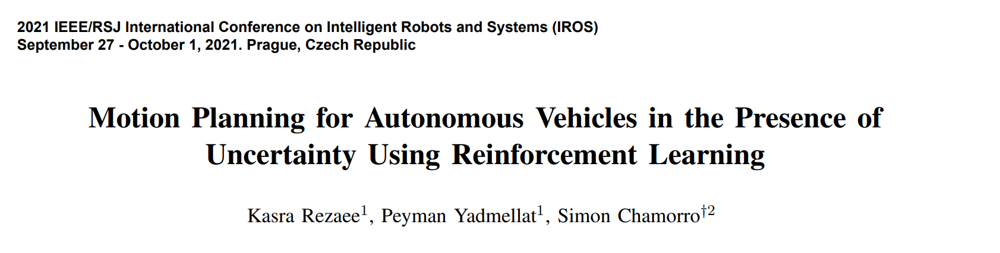
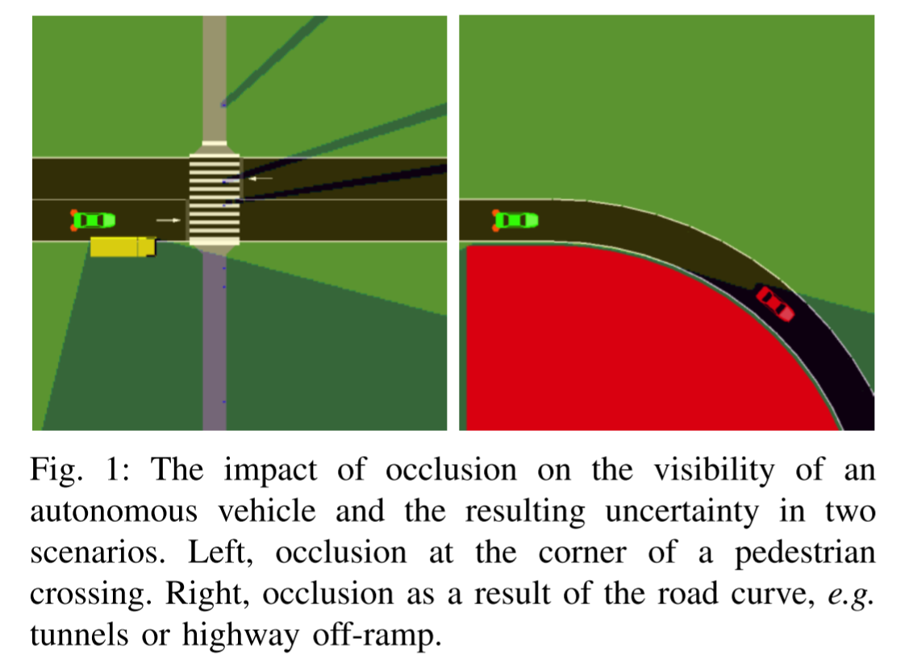
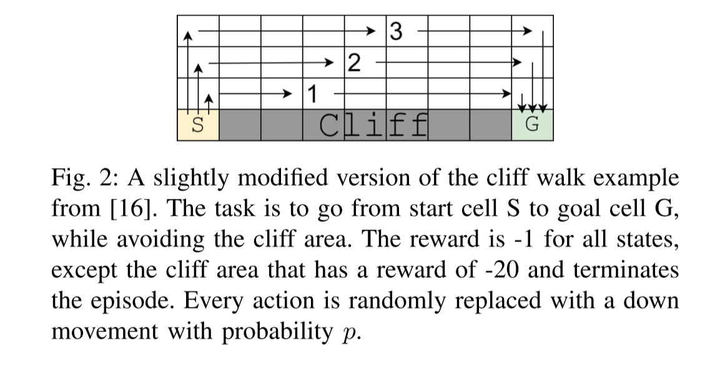
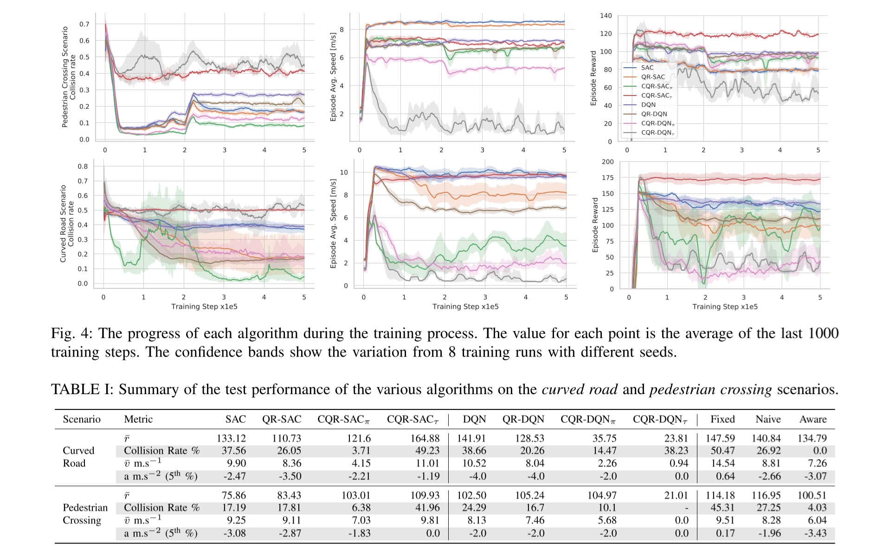
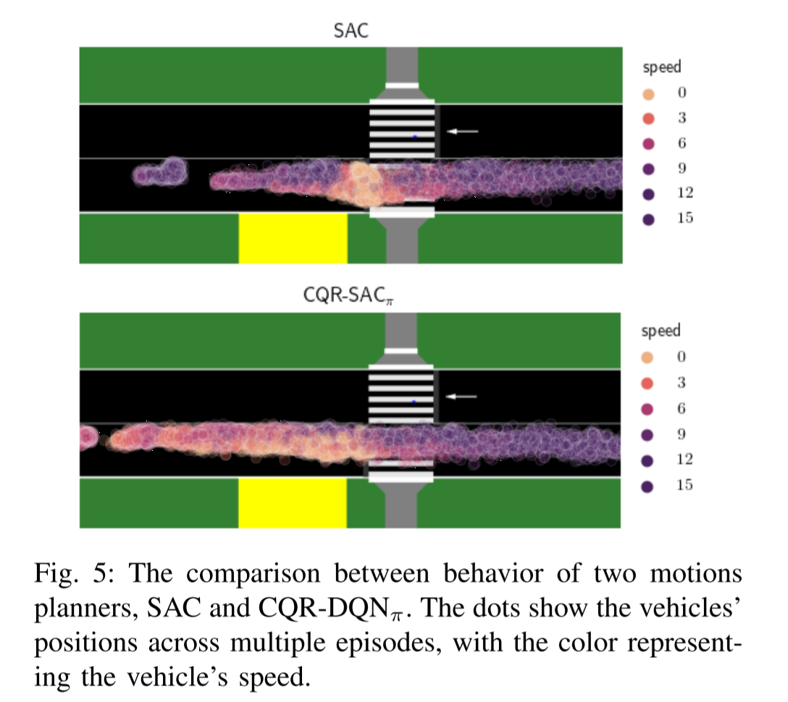

# [PaperReading RL 03]Motion Planning for Autonomous Vehicles in the Presence of Uncertainty Using Reinforcement Learning

**IROS 2021 Affiliation Noah’s Ark Lab., Huawei Technologies Cannada**

[论文链接](https://ieeexplore.ieee.org/abstract/document/9636480)

## 0\. Summary

## 1\. Research Objective(s)

### 1.1 Can we tackle the motion planning in uncertainty scenario with little computation?
    
+ use RL 

### 1.2 How can RL-based method ensure safety?

+ consider worst-case scenario (这里安利另一篇AAAI的论文，欢迎关注，代码开源 [code](https://github.com/AlgTUDelft/WCSAC)，paper，[WCSAC](https://www.st.ewi.tudelft.nl/mtjspaan/pub/Yang21aaai.pdf))

## 2\. Background

+ Motion planning under uncertainty is one of the main challenges because occlusion on the visibility of an AV for example:

    

+ previous method is considering hypothetical hidden objects. but it has these limits (when there are numerous hypothetical objects):

    1. conservative planning

    2. expensive computation

## 3\. Method(s)

### 3.1 RL 

1. build a MDP model

2. object：find an optimal policy to maximize the expected future total reward

### 3.2 The Case Against Maximizing Average Reward

there is an example:

the optimal path is varing with the probability. If p = 0.1, the optimal path is 2 while it maight be path 1 if p = 0.01. Besides, rewards are hard to defined and p is not a priori in the applicaiton.

### 3.2 Distributional RL to the Rescue

The total return associated with taking action a in state s and following a policy π would be defined by a random variable:

$$Z^{\pi}(s,a)= \sum _{t=0}^{\infty}\gamma ^{t}r_{t},$$

and we assign the velue of a state as the worst case of its possiable outcomes:

$$Q^{\pi}(s,a)=\inf(Z^{\pi}(s,a)),$$

where $\inf$ presents the lower bound. Using Quantile Regression (QR) to estimate the distribution of the random variable $Z$.

这个文章科普了什么是分数回归模型（[Quantile Regression](https://zhuanlan.zhihu.com/p/60912847)）

### 3.3 Formulation of Conservative Reinforcement Learning

In QR-DQN, the value of a state-action pair as the mean of the distribution defined by the quantiles $j$: 

$$Q^{\pi}(s,a)= \sum _{j=1}^{N}\frac{1}{N}q_{j}(s,a).$$

Using quantile regression for estimating the value of quantiles, the regression process result in values is sorted from lowest to highest. Use the first value to estimate the lower bound which presents the $Q$ value:

$$Q^{\pi}(s,a)=q_{1}(s,a),$$

where $q_1$ is the first value of the QR results. This modification is done when calculating the targets for the learning step and when choosing the optimal action. The name of this algorithm: Conservative QR-DQN (CQR-DQN)

In sac, we use the previous defined equation to approximate the Q value, and update critic network by the following

$$Z^{\pi}(s,a) \mathop{:=}\limits^{D} r(s,a)+ \gamma(Z^{\pi}(s^{\prime},a^{\prime})- \log \pi(a^{\prime}|s^{\prime}))$$

I guess this equation means that it utilizes the lowest value of $Z$ to approximate the target Q.This algorithm is Conservative QR-SAC (CQR-SAC), where QR-SAC refers to the SAC algorithm augmented with quantile regression while still maximizing the average return.

### 3.4 MOTION PLANNING UNDER UNCERTAINTY

1. Input: an occupancy grid map (OGM) combined with an image of the road network.

2. Final Output: a trajectory which is parameterized by current speed, $v_0$, current lateral offset, $l_0$, final speed, $v_f$, and final lateral offset, $l_f$. Time interval is predefined.

3. motion planner of RL: The two variables $v_0$ and $l_0$ are based on the vehicle’s current state, provided to the motion planner as inputs, and the motion planner needs to optimize $v_f$ and $l_f$, which are also the action of the RL.

4. Reward design: 

    $$r= \left\{ \begin{matrix} 0, \quad \text{if collision} \\ 1+r_{m}+r_{c},\quad \text{otherwise} \\ \end{matrix} \right. ,$$

    where 

    $$r_{m}= \left\{ \begin{matrix} v, \quad \text{if}\ v \leq v_{lim}\\ \max(0,v-(v-v_{lim})^{2}), \quad \text{otherwise} \\ \end{matrix} \right. .$$

    and $r_c=-a^2-|l|$ discourages excessive acceleration and deviation from the center of the lane.

5. Evaluating a Trajectory Versus Policy: 

> From an RL perspective, if the agent’s action is defined as the trajectory, evaluating a trajectory is equivalent to estimate the Q-value with the assumption that the agent’s action in future tates will be the same as the one in the current state.

Therefore, use the current action to update the Q network. 

$$Z(s,a) \mathop{:=}\limits^{D} r(s,a)+ \gamma Z(s^{\prime},a),$$

named as $\text{CQR-DQN}_\tau$, $\text{CQR-SAC}_\tau$.

## 4\. Evaluation

>The fixed planner drives at the speed limit and does not consider other objects. The naive planner ignores the occlusion and drives at the speed limit unless it sees an object in its driving path. The aware planner is aware of the occlusion. It assumes that an object is present in the occluded area and drvies at a speed that makes it possible to slow down to full stop without collision.

## 5\. Conclusion

propose a method taht tackle the motion planning problem in the presence of uncertainty caused by occlusion.

1. leverage the distributional RL to maximize the worst case instead of the average reward.

2. using quantile regression were proposed to find the action that optimizes the worst-case scenario.

## 6\. Notes

1. why is the Guassian Process not suitable to estimate the lower bound ? (the following passage is the original text)

    > Since we want to estimate the lower bound, a Gaussian distribution is not suitable for this purpose. We propose to extend SAC with quantile regression.

## 7\. References

Generally, this paper aims to maximize the minimum Q value in a distribution. But safe RL is also a possiable way to solve these challenging scenarios, e.g., uncertainty scenarios. 

[1] Z. Liu et al., ‘Constrained Variational Policy Optimization for Safe Reinforcement Learning’, in Proceedings of the 39th International Conference on Machine Learning, Jun. 2022, pp. 13644–13668. Accessed: Sep. 29, 2022. [Online]. Available: https://proceedings.mlr.press/v162/liu22b.html

    
