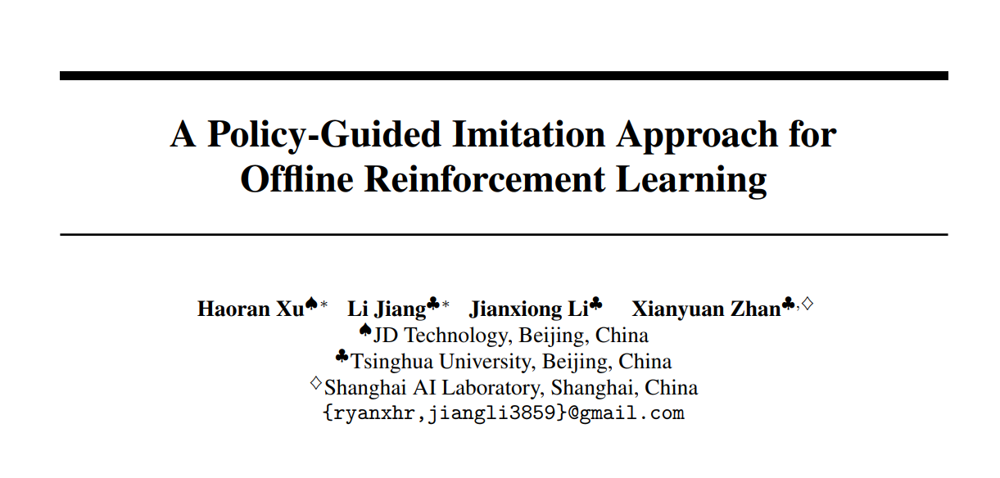
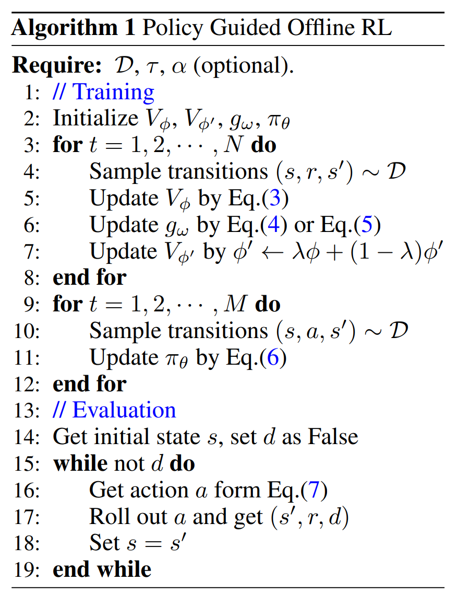
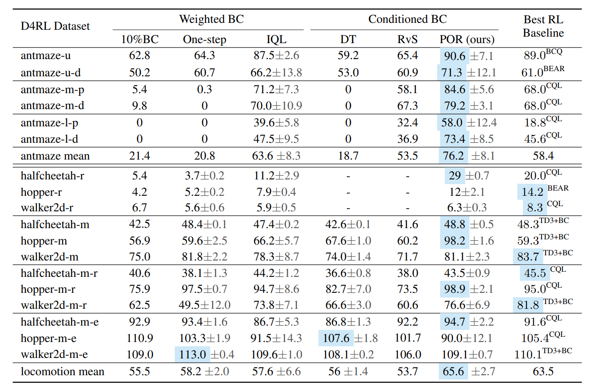
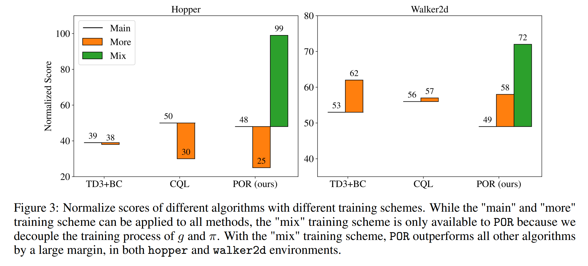
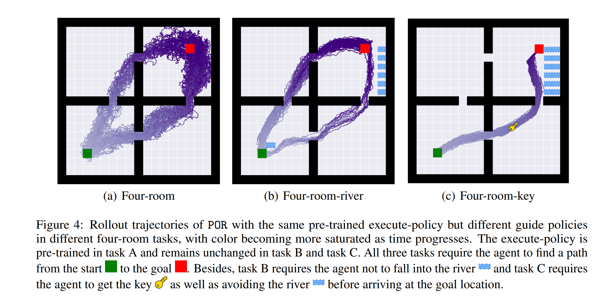

# [PaperReading 04]

**NIPS 2023 oral**

[论文链接](https://arxiv.org/abs/2210.08323)

## 0\. Summary

## 1\. Research Objective(s)

## 2\. Background

### 2.1 Current Problem

Offline RL has two types: RL-based and imitation-based. But offline RL methods has limitations, 

+ the out-of-distribution (OOD) actions can be deemed as adversarial examples of the Q function, which cause extrapolation error of the Q-function;

+ the error will be accumulated when DP;

+ can not be eliminated without requiring a growing batch of online samples.

### 2.2 Previous Solution

+ add a behavior regularization term;

+ querying the values of unseen actions by IL.

But, they lose the ability to surpass the dataset.

## 3\. Method(s)

### 3.1 Preliminaries

1. Offline RL:

The goal of the RL agent is to maximize the expected cumulative discounted reward:

$$ \mathop{\max}\limits_{\pi}  \quad  \left[ \sum _{t=0}^{\infty}\gamma ^{t}r(s_{t},a_{t})|s_{0}=s,a_{0}=a,s_{t}\sim T(·|s_{t-1},a_{t-1}),a_{t}\sim \pi((·|s_{t})\ \text{for}\ t \geq 1 \right].$$

In this work, the goal is to learn a policy from a fixed dataset $D$. 

>The underlying behavior policy of $D$ as $\mu$, which represents the conditional distribution $p(a|s)$ observed in the dataset.

2. RL via Supervised Learning

The authors seek a policy $\pi$ that optimizes:

$$ \mathop{\max}\limits_{\pi}\ E_{\tau \sim D,t \sim \text{Unif}(1,H), \omega \sim g(\cdot | \tau _{t:H})} \left[ \log \pi(a_{t}|s_{t}, \omega)\right] .$$

From my opinion, this function is to maximize the negtive entropy.

### 3.2 Policy-guided Offline RL

The basic idea is train two policies, guide-policy and execute-policy. The main function of these two policies are:

+ guide-policy: learn the optimal $s_{t+1}$ given $s_t$;

+ execute-policy: learn how different actions can produce different next state.

Generally, the guide-policy serves as a guide for the execute-policy by telling it where to go for the maximum return.

#### 1. Learning the guide-policy

**Goal:Train a state value function** 

Only use the $(s,s')$ samples from dataset $D$. The loss function is:

$$ \mathop{\min}\limits_{\phi} E_{(s,r,s^{\prime})\sim D} \left[ L_{2}^{T}(r+ \gamma V_{\phi ^{\prime}}(s^{\prime})-V_{\phi}(s))\right] ,\ \text{where}\ L_{2}^{T}(u)=| \tau -1(u<0)|u^{2}.$$

However,

> Maximizing the guide-policy with respect to $V(s)$ will result in a state where the execute-policy may make erroneous generalization.

Adding a behavior cloning term could alleviate this issue. $g_{\omega}(s)$ is the guide-policy:

$$ \mathop{\max}\limits_{\omega}\ E_{(s,s^{\prime})\sim D} \left[ V_{\phi}(g_{\omega}(s))+ \alpha \log g_{\omega}(s^{\prime}|s)\right] ,$$

where $\alpha$ is a trade-off.

Additionally, the authors provide a loss function works well in practive：

$$ \mathop{\max}\limits_{\omega}\ E_{(s,s^{\prime})\sim D} \left[ e^{(r+ \gamma V_{\phi ^{\prime}}(s^{\prime})-V_{\phi}(s))} \log g_{\omega}(s^{\prime}|s)\right] .$$

#### 2. Learning the execute-policy

**Goal: improve the generalization**

This policy $\pi_{\theta}(s,s')$ shows the relation ship (each action has how much probability to reach $s'$) between the current state $s$ and next state $s'$.

The loss is:

$$ \mathop{\max}\limits_{\theta}\ E_{(s,a,s^{\prime})\in D} \left[ \log \pi _{\theta}(a|s,s^{\prime})\right].$$

>During evaluation, given a state $s$, the final action is determined by both the guide-policy and the execute-policy, by

$$a=arg \mathop{\max}\limits_{a}\ \pi _{\theta}(a|s,g_{\omega}(s)).$$

**Final Algorithm**

### 3.3 Analysis

+ give the lower bound of f the performance difference between POR and the optimal policy π*

+  analyze how the guide-policy $g$ will influence this bound.

## 4\. Evaluation

1. Baseline: 
+ RL-based method: BCQ, BEAR, BRAC, CQL, and TD3+BC

+ Imitation-based method: 

    + Weighted BC: 10%BC, One-step RL, and IQL

    + Conditioned BC: DT, RvS

2. Results:

3. Validation Experiments on OOD

compare the distribution of $g(s)$ generated by the guide-policy with the distribution of $s'$ from the offline dataset.

4. Investigations on Guide-policy

+ Improve guide-policy by additional suboptimal data

add suboptimal dataset for training

+ Change guide-policy without execute-policy in new task env.

## 5\. Conclusion

+ provide a hierarchical policy scheme. Guide-policy generates next state while execute-policy shows the distribution of action to reach the next state.

+ has a generalization ability.

+ change guide-policy for new task without changing execute-policy.

+ reduce the quality of dataset.

## 6\. Notes

## 7\. References

    
